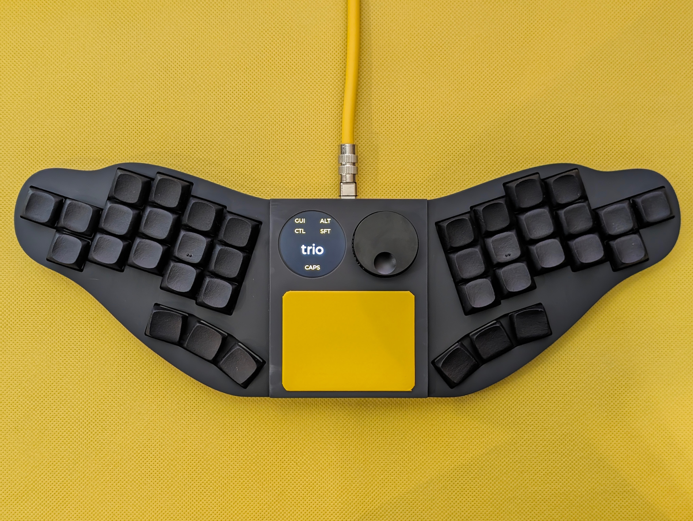
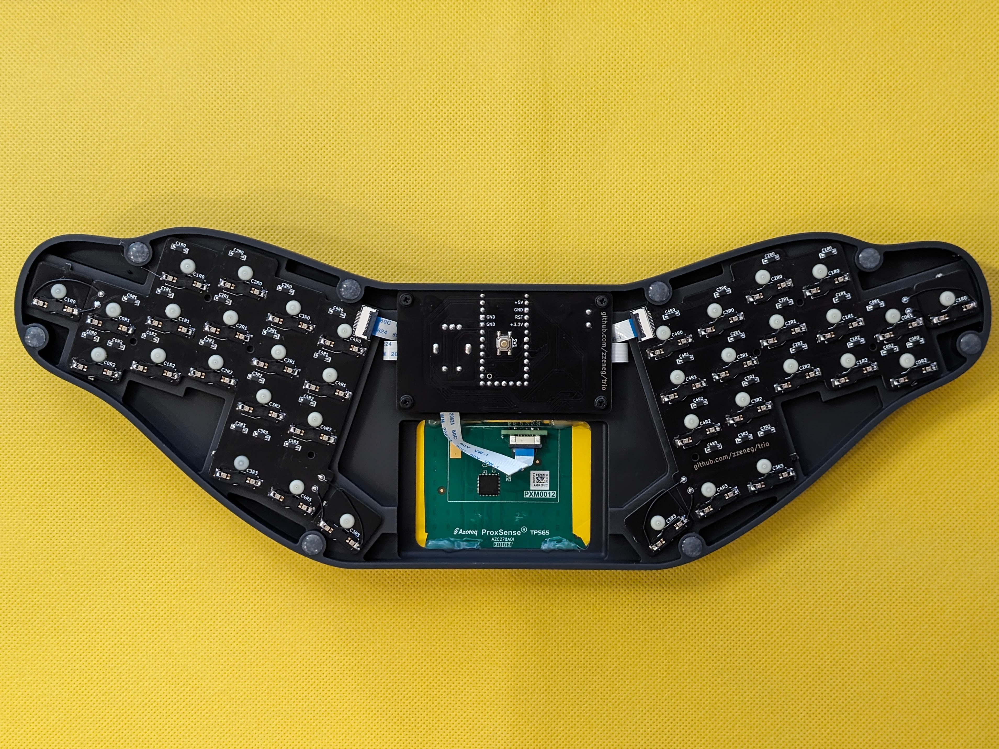
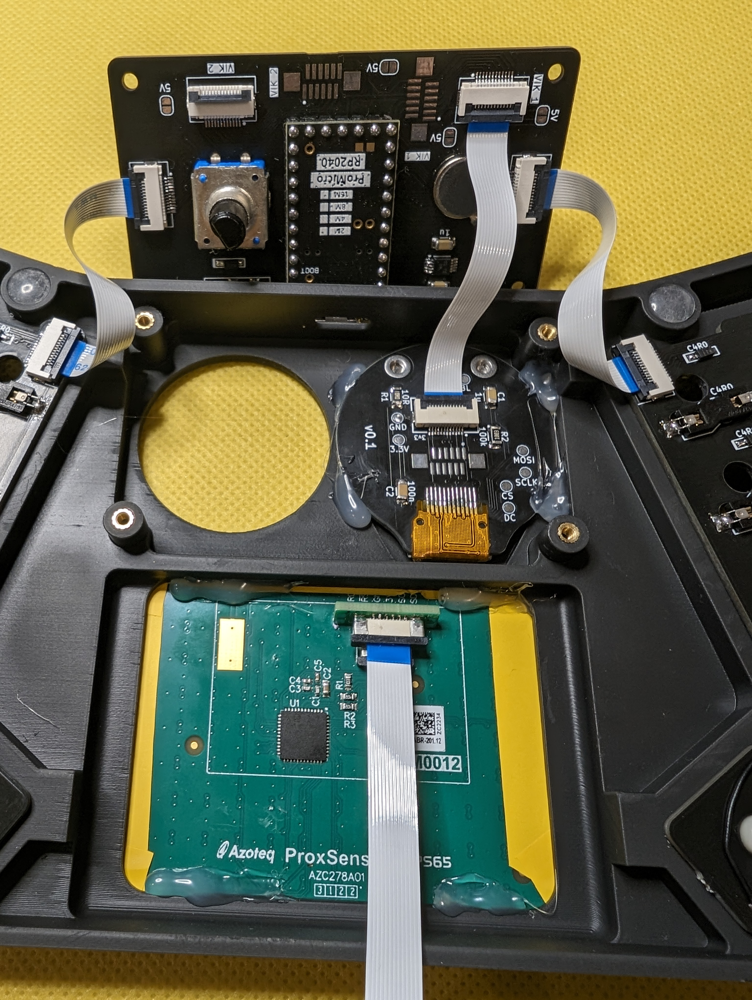
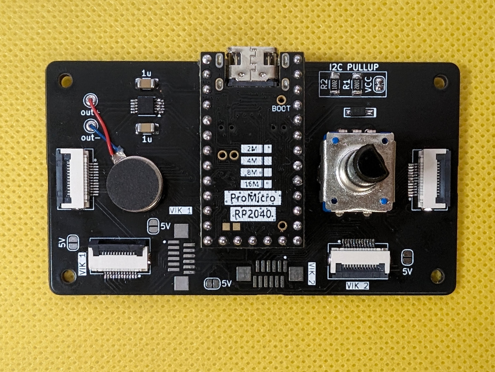

# trio

Modular unibody keyboard with two VIK modules.

> [!CAUTION]
> This keyboard is designed for minimal vertical spacing (19x16mm). Regular keycaps will not fit, you must print your own - for example my [DES MinY](https://github.com/zzeneg/PseudoMakeMeKeyCapProfiles?tab=readme-ov-file#update-from-zzeneg).
>
> It's created as a cheap prototype to test VIK abilities and modules - all PCBs are under 100x100mm, one-piece case <0.3kg for cheap JLCPCB shipping.
>
> Build process requires a lot of hand-soldering with 0.5mm pitch, you need good tools and experience to do that.
>
> I do not recommend to build it exactly like that, but to use it as inspiration for your projects. Feel free to use and improve KiCad and Fusion 360 source files.

## Features

- **MinY (19x16mm) spacing**
- 36 KS-33 (Gateron Low Profile) keys with hotswap
- central PCB with two independent VIKs, DRV2605L haptic feedback and rotary encoder
- periferal PCBs for keys
- 3D printed case with 1.28" display, Azoteq TPS65 touchpad and 33mm encoder

## Photos

## Gerber files

- [Main PCB](./pcb/production/main.zip)
- [Side PCB](./pcb/production/side.zip)
- Azoteq [VIK adapter](https://github.com/sadekbaroudi/vik/tree/master/pcb/azoteq-tps)
- Display [VIK adapter](https://github.com/zzeneg/vik-display-adapter) - 1.28" round version

## Case files

- [v0.1](./case/main-0.1.stl)
- [v0.2](./case/main-0.1.stl) - higher version, should work but untested

## Firmware

[Companion app](https://github.com/zzeneg/qmk-hid-host) for Raw HID communication. Use `"productId": 2120` for that keyboard.

#### QMK

Please see main `config.h` and `rules.mk` for comments and available options.

- [source code](https://github.com/zzeneg/qmk_firmware/tree/feature/zzeneg/keyboards/trio)
- [pre-compiled files](https://github.com/zzeneg/qmk_firmware/releases/tag/zzeneg)

#### Vial

- [source code](https://github.com/zzeneg/vial-qmk/tree/feature/zzeneg/keyboards/trio)
- [pre-compiled files](https://github.com/zzeneg/vial-qmk/releases/tag/zzeneg)

## Bill of materials

- [PCB](./pcb/production/pcb.zip)
- 36 KS-33 switches
- 36 hotswap sockets for KS-33 switches
- 3D printed case
- Azoteq TPS65 touchpad
- Azoteq [VIK adapter](https://github.com/sadekbaroudi/vik/tree/master/pcb/azoteq-tps)
- Bare 1.28" round [display](https://www.aliexpress.com/item/1005006051175539.html) - **without PCB**
- Display [VIK adapter](https://github.com/zzeneg/vik-display-adapter) - 1.28" round version **+ adapter's BOM**
- Helios-sized (26 GPIOs) [RP2040](https://www.aliexpress.com/item/1005006130019224.html) MCU
- 37 [SMD SOD-123 1N4148](https://www.aliexpress.com/item/1005002882901030.html) diodes
- [Vertical](https://www.aliexpress.com/item/10000000737049.html) and [horizontal](https://www.aliexpress.com/item/4000106123266.html) 12pin FFC/FPC connectors
- 12pin 0.5mm pitch 6cm [FFC cable](https://www.aliexpress.com/item/1005002468369055.html) - **both reverse and forward variants**
- short [EC11 rotary encoder](https://www.aliexpress.com/item/1005002109267228.html)
- 32mm [encoder knob](https://www.aliexpress.com/item/32749414806.html)
- SMD 4x4x1.5mm [push button](https://www.aliexpress.com/item/32802382507.html)
- 4mm [M2 screws with flat head](https://www.aliexpress.com/item/4001248931159.html)
- M2 [heatset inserts](https://www.aliexpress.com/item/1005004624377733.html) - 3mm length, 3.2mm diameter for resin case or 3.5mm for Nylon/PLA
- [7x1.5 legs](https://www.aliexpress.com/item/1005002995402961.html)
- for haptic feedback:
  - DRV2605L motor controller
  - 2 1uF capacitors (SMD 1206 size)
  - 2 4.7kOhm resistors (SMD 1206 size)
  - LRA or ERM [motor](https://docs.qmk.fm/#/feature_haptic_feedback?id=known-supported-hardware)

## Build notes

- side PCBs have two keys that have to be broken off and handwired to correct places (diodes stay on the big part)
- rotary encoder uses GPIO from VIK2, so Azoteq has to be connected to VIK2 port, and display to VIK1. Make sure to bridge solder jumpers on the back.
- cheap ERM motors may not have enough internal resistance, if you motor does not work, try to add 5-10R resistor to it
- see photos for FFC connections

## Development

For proper KiCad setup install my [zzkeeb](https://github.com/zzeneg/zzkeeb/blob/main/README.md#installation) library

## Support

If you like my work and want to support my future designs, please consider [sponsorship](https://github.com/sponsors/zzeneg).

#### Sponsors

Thank you very much for your support!

